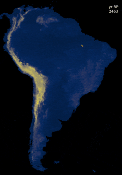
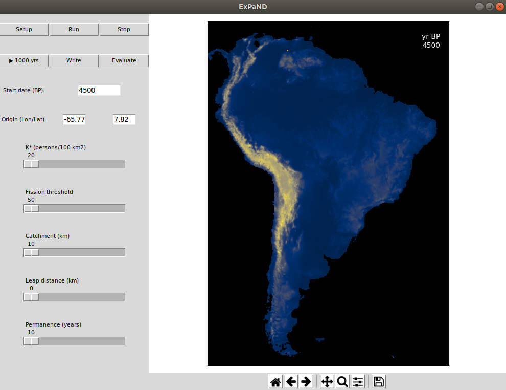
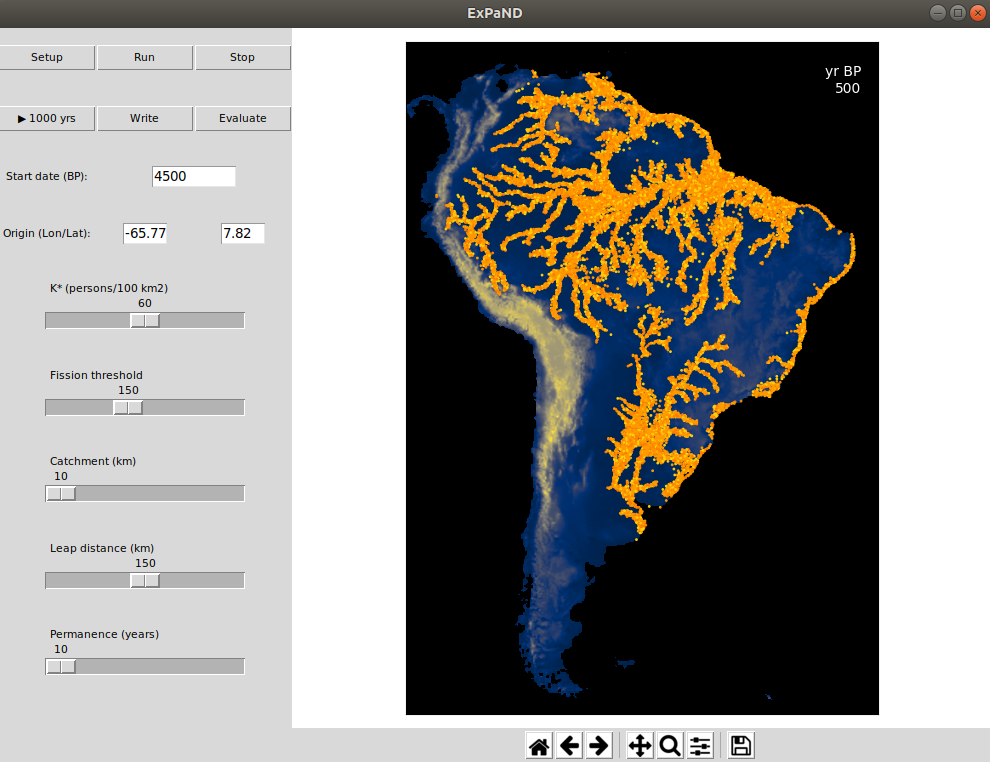
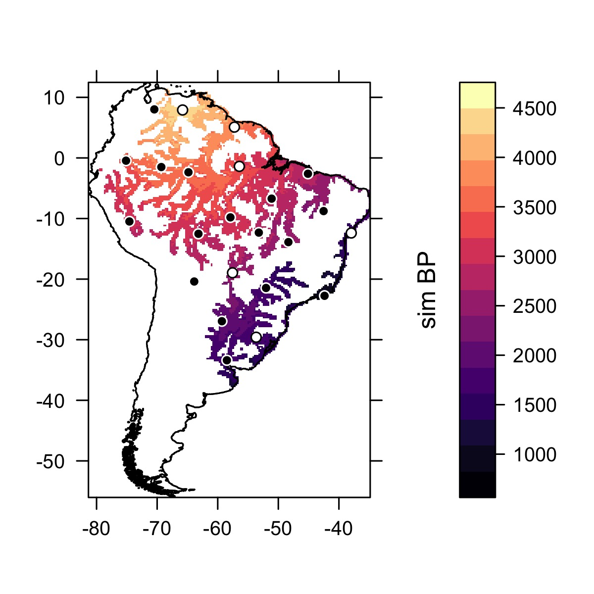

# ExPaND
<h2>Simulating demic expansion of farmers in tropical South America</h2>
</img>
<p>This is an agent-based model for simulating the demic expansion of tropical forest farmers in late Holocene South America. Over the last 5000 years, archaeological cultures like the Saladoid-Barrancoid and Tupiguarani expanded over different parts of Amazon and beyond, spreading the practice of polyculture agroforestry. Can these archaeological expansions be modelled as demic waves of advance similar to what has been proposed for the Neolithic in Eurasia? Model results are assessed by comparing simulated arrival times with radiocarbon dates. Similar models, where human expansions are determined by population growth, fission and relocation, have been developed for the spread of farming in Europe (<a href="https://doi.org/10.7183/0002-7316.77.2.203">Fort et al. 2012</a>; <a href="https://doi.org/10.1073/pnas.1613413114">Isern et al. 2017</a>). The same concept is adopted here, with the rules of the model informed by the ethnography of tropical forest farmers. For a complete description of the model, see Souza et al. (<a href="https://doi.org/10.1371/journal.pone.0232367">2020</a>).</p>
<h3>Installation</h3>
<p>Clone or download the repository. There are some dependencies that need to be installed, including tkinter for the GUI:</p>
```
sudo apt-get install python3-tk
pip3 install -r requirements.txt
```
<h3>Model architecture</h3>
<p>Expansions result from the interaction between population growth, village fission and village relocation. Each village has a territory within a <i>catchment radius</i> and a <i>maximum population density</i> (<i>K*</i>). The population grows at a rate of 2.5% per year. If the population is above the maximum density, more cells (10 x 10 km) are added to its territory. When the village population is above a certain <i>threshold</i> and there are free cells outside of its catchment, it fissions, giving birth to a new village. If a village has been in its location beyond a <i>maximum permanence time</i>, it also looks for free cells outside its catchment to move. Finally, villages have the option to <i>leapfrog</i>: if there are no free cells in the immediate neighbourhood, they can jump over longer distances.</p>
<p>The model starts with a village whose population is at the fission threshold, so that it immediately fissions and starts the expansion.</p>
<p>When fissioning or moving, villages choose the best cell according to a suitability layer. Here, a layer env.asc is provided in the <code>/layers</code> folder for illustrative purposes. The layer was created using MaxEnt and sites from different archaeological cultures of tropical forest farmers as presence points. In the code, a parameter <code>tolerance</code> is passed to the agents, determining the minimum value for a cell to be settled. In this version, the value 0.43 was used, based on the equal training sensitivity and specificity threshold of the MaxEnt results (rather than maximum training sensitivity and specificity, which would result in a more restricted inhabitable area).</p>
<h3>Running the model</h3>
<p>In the code that is made available here, the model can be run from a GUI:</p>
```
python3 app.py
```
</img>
<p>On the left panel, one can alter the start date (BP) for the beginning of the expansion, the coordinates (lonlat) of the first village and the model parameters: maximum population density (persons 100 km<sup>-2</sup>), fission threshold, catchment radius (km), leap distance (km) and maximum permanence time (years).</p>
<p>For now, let's keep the start date at 4500 BP and the initial coordinates of -65.77 7.82 (approximate coordinates of La Gruta, which potentially contains some of the earliest Saladoid-Barrancoid ceramics). Let's modify some of the demographic and territorial parameters: increase the <i>K*</i> to 60, the fission threshold to 150 and the leap distance to 150 km. Once the parameters are set, it is necessary to click on the <code>Setup</code> button. After the model has been setup, you can run it clicking on <code>Run</code> to visualise every step. You can pause it at any moment clicking <code>Stop</code>. Because visualization at every step may take a long time, it is possible to run 1000 years at once by clicking <code>►1000 yrs</code>. Let's do that until the model reaches the year 500 BP.</p>
</img>
<p>The results of the model can be evaluated by comparing simulated arrival times with radiocarbon dates in different regions. The calibrated dates you want to use for comparison must be placed in the folder <code>/dates</code>. Files must be in .csv format with two columns, one for each date, with a first row containing XY coordinates for the dated site in lonlat format and the remaining rows containing years BP and the respective probability densities. For illustrative purposes, the version that is available here comes with 23 dates representing the earliest dates per region for several archaeological cultures (Saladoid-Barrancoid, Incised-Punctate, Tupiguarani etc.). When clicking <code>Evaluate</code>, the result is a score from 0 to 1 obtained by summing the intercepted normalised probability at each dated site (or 0 if the simulated arrival time is outside of the calibrated distribution) and dividing by the number of dates.</p>
<p>You can save the results to be used in other software by clicking <code>Write</code>. This creates two files in the <code>/results</code> folder: one starting with <code>sim...</code> containing the simulated arrival times and the other starting with <code>dates...</code> containing the intercepted probability densities.</p>
<p>Here is a quick plot in R with the results of the model we just ran:</p>
</img>
<p>Here, the white dots are locations where the simulated arrival times are within the calibrated ranges of the actual dates, whereas the black dots are locations where the calibrated dates have not been intercepted by the simulation (see similar plots in Isern et al. 2017; Souza et al. 2020). The code for making this plot is available here.</p>
<p>Be aware that the comparison above was for illustrative purposes only. Dates from several different cultures were used, hence the poor correlation with the simulated arrival times.</p>
<h3>References</h3>
<p>Fort, Joaquim, Toni Pujol, and Marc Vander Linden. 2012. <a href="https://doi.org/10.7183/0002-7316.77.2.203">“Modelling the Neolithic Transition in the Near East and Europe.”</a> American Antiquity 77 (2): 203–19.</p>
<p>Isern, Neus, João Zilhão, Joaquim Fort, and Albert J Ammerman. 2017. <a href="https://doi.org/10.1073/pnas.1613413114">“Modeling the Role of Voyaging in the Coastal Spread of the Early Neolithic in the West Mediterranean.”</a> Proceedings of the National Academy of Sciences 114 (5): 897 LP – 902.</p>
